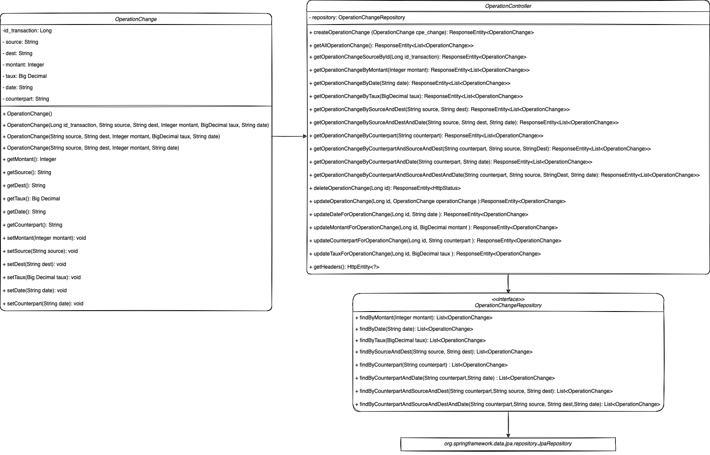

# Projet Application WEB Orientée Services


# Developpeurs : Henri Aycard (@HenriAycard) & Antoine Perrin (@ahgperrin)
# Cadre : Obtention du Master 2 MIAGE Informatique pour la Finance
# Enseignants : Mouloud Menceur
# Soutenance : Lundi 5 Juillet 13h30
# Langage : JAVA
# Stack : SpringBoot / Docker / JUnit


# Présentation du projet 
Ce projet prend par au seiun de notre formation à l'université Paris Dauphine En miage INformatique pour la finance. 
L'objectif pédagogique du projet est de manipuler la stack SpringBoot Java et d'apprendre à creer des microservices WEB.
Au sein de ce projet nous avons choisi de réaliser deux Microservices, TauxChange et OperationChange. Notre Application
se présente sous la forme d'un bureau de change en ligne accésible en ligne de commande.
Dans cette partie nous allons simplement présenter de manière brève les deux microservices et le processus d'installation.
Un fichier README.md est disponible pour chaque microservice au sein de leur Repo respectifs.
Nous avons choisi d'aggreger le README.md de chaque microservices sous celui-ci en guise de documentation complète.

# Architecture
Le projet est composé de deux micro-services indépendants. Le micro-services OperationChange peut communiquer avec TauxChange 
lorsqu'on crée une nouvelle opération et que l'utilisateur ne spécifie pas de taux. Mais le micro-services OperationChange peut aussi fonctionner 
sans que le micro-service TauxChange soit démarré, dans ce cas l'utilisateur devra spécifier un taux à sa création.

Chaque micro-service possède un REST API et une base de donnée indépendante. Les utilisateurs peuvent réaliser des requêtes HTTP (POSR, GET, PUT, DELETE) sur un navigateur ou en ligne de commande.

## Taux de change
Ce microservice a pour but de publier et stocker les taux de change par date au sein d'une base de données sous H2.
Le taux de change est exprimé dans une devise vers l'autre devise avec une date et chaque entrée a un Id clé primaire unique.
Le microservices Taux de change est disponible sous : 
```yaml
https://github.com/HenriAycard/Microservice-TauxChange.git
```
Le microservice doit être cloné en local:

```yaml
git clone https://github.com/HenriAycard/Microservice-TauxChange.git
```
Il peut être installé et lancé selon la procédure spécifique du README.md TauxChange,
ou être ouvert dans IntelliJ via pom.xml as a project et lancé via TauxChangeApplication sous main/java/Repository
Une fois lancé , il suffit d'ouvrir un terminal et d'ecrire les requêtes directement dedans.

## Operation de change
Ce microservice a pour but de gérer les opérations de change effectuées et de les stocker dans une base de données sous H2.
L'objectif est de pouvoir accéder aux opérations de change via des requêtes en ligne de commandes. Chaque opération est identifiée
via son Id clé primaire, et comporte des informations comme le taux, la contrepartie de l'opération, la paire de devises, le taux ou 
bien encore la date.
Si le taux n'est pas spécifié il est automatique recupéré depuis le microservice TauxChange, si ce dernier est lancé sur la machine.

Le microservices Operation de change est disponible sous :
```yaml
https://github.com/HenriAycard/Microservice-OperationChange.git
```
Le microservice doit être cloné en local:

```yaml
git clone https://github.com/HenriAycard/Microservice-OperationChange.git
```
Il peut être installé et lancé selon la procédure spécifique du README.md OperationChange,
ou être ouvert dans IntelliJ via pom.xml as a project et lancé via OperationChangeApplication sous main/java/Repository
Une fois lancé , il suffit d'ouvrir un terminal et d'ecrire les requêtes directement dedans.

## Test

Nos deux microservices possèdent des tests unitaires dans leur repo test.

### Taux Change Controller
```bash
/src/test/java/fr/dauphine/miageif/tauxchange/TauxChange/Controller/ChangeControllerTest
```
### Taux Change Model
```bash
/src/test/java/fr/dauphine/miageif/tauxchange/TauxChange/Model/TauxChangeTest
```
### Operation Change Controller
```bash
/src/test/java/fr/dauphine/miageif/operationchange/OperationChange/Controller/ChangeControllerTest
```
### Operation Change Model
```bash
/src/test/java/fr/dauphine/miageif/operationchange/OperationChange/Model/OperationChangeTest
```

## Docker 
Docker possède un format de fichier "Dockerfile" simple qui est utilisé pour spécifier les "layers" d'une image. Nous avons créé le Dockerfile suivant dans notre projet Spring Boot
```bash
FROM openjdk:11
ARG JAR_FILE=target/*.jar
COPY ${JAR_FILE} app.jar
ENTRYPOINT ["java","-jar","/app.jar"]
```

## Minikube
Nous n'avons pas obtenu de résultats a présenter sous minikube.

# Microservices - TauxChange

## Presentation
Gérer (créer , récupérer , modifier , supprimer) des taux de change entre deux devises. Un taux de change se caractérise
par {"devise source" : "EUR", "devise destination" : "USD", "taux" : 1.22, "date" : "2021-05-25"} signifiant qu’en date
du 25 mai 2021, 1 euro vaut 1.22 dollar US.

## Diagramme de classe


# Installation
```bash
git clone https://github.com/HenriAycard/Microservice-Tauxchange.git
```
```bash
mvm clean install package
```
## Set up the Spring Boot Application
```bash
./mvnw package && java -jar target/tauxchange
```
## Set up Docker
```bash
docker build -t springio/tauxchange .
docker run -p 8000:8000 -t springio/tauxchange
```
# Rest API
## Methods

| Methods | Urls                                    | Actions                                     |
| :----------:|:----------------------------------------| :-------------------------------------------|
| POST      | /taux-change                            | create new Taux Change                      |
| GET        | /taux-change                            | retrieve all Taux Change                    |
| GET        | /taux-change/id/{id}                    | retrieve Taux Change by {id}                |
| GET        | /taux-change/source/{source}            | retrieve Taux Change by {source}            |
| GET        | /taux-change/dest/{dest}                | retrieve Taux Change by {dest}              |
| GET        | /taux-change/date/{date}                | retrieve Taux Change by {date}              |
| GET        | /taux-change/source/{source}/dest/{dest}| retrieve Taux Change by {source} and {dest} |
| PUT        | /taux-change/id/{id}                    | update all Taux Change by {id}              |
| PUT        | /taux-change/id/{id}/date/{date}        | update {date} of Taux Change by {id}        |
| PUT        | /taux-change/id/{id}/taux/{taux}        | update {taux} of Taux Change by {id}        |
| DELETE  | /taux-change/id/{id}                    | delete Taux Change by {id}                  |

# Utilisation
## POST
### create new Taux Change
```bash
curl -X POST -H "Content-type: application/json" -d "{\"source\" : \"AUD\", \"dest\" : \"USD\",
\"taux\" : 0.7586, \"date\" : \"2021-06-25\"}" "http://localhost:8000/taux-change"
```
```yaml
{
  "source":"AUD",
  "dest":"USD",
  "taux":0.7586,
  "date":"2021-06-25"
}
```
## GET
### retrieve all Taux Change
```bash
curl -X GET "http://localhost:8000/taux-change"
```

### retrieve Taux Change by {id}
```bash
curl -X GET "http://localhost:8000/taux-change/id/10001"
```

### retrieve Taux Change by {source}
```bash
curl -X GET "http://localhost:8000/taux-change/source/USD"
```

### retrieve Taux Change by {dest}
```bash
curl -X GET "http://localhost:8000/taux-change/dest/USD"
```

### retrieve Taux Change by {date}
```bash
curl -X GET "http://localhost:8000/taux-change/date/2021-06-25"
```
### retrieve Taux Change by {source} and {dest}
```bash
curl -X GET "http://localhost:8000/taux-change/source/EUR/dest/USD"
```

## PUT
### update all Taux Change by {id}
```bash
curl -X PUT -H "Content-type: application/json" -d "{\"source\" : \"AUD\", \"dest\" : \"USD\", 
\"taux\" : 0.7582, \"date\" : \"2021-06-24\"}" "http://localhost:8000/taux-change/id/10016"
```

### update {date} of Taux Change by {id}
```bash
curl -X PUT "http://localhost:8000/taux-change/id/10016/date/2020-06-25"
```

### update {taux} of Taux Change by {id}
```bash
curl -X PUT "http://localhost:8000/taux-change/id/10016/taux/0.7582"
```

## DELETE
### delete Taux Change by {id}
```bash
curl -X DELETE "http://localhost:8000/taux-change/id/10016"
```

# Microservices - Operation Change

## Presentation
Gerer les operations de change. Une opération de change se caractérise par {"id transaction": 12345, "devise source": "EUR", "devise destination": "USD",
"montant": 1000, "date": "2021-05-25", "taux": 1.22, "counterpart": "Antoine Perrin"} signifiant qu'en date du 25 mai 2021, une opération de change, identifiée par le numéro 12345, de 1000 euros
en dollard US a été réalisée au taux EUR/USD = 1.22 par la contrepartie Antoine Perrin.
Il est possible grâce a ce microservice de publier, requêter, modifier ou bien encore supprimer des opérations de change.

## Diagramme de classe



# Installation
## Set up the Spring Boot Application
```bash
./mvnw package && java -jar target/operationchange
```
## Set up Docker
```bash
docker build -t springio/operationchange .
docker run -p 8080:8080 -t springio/operationchange
```
## Methods

| Methods   | Urls                                                                                  | Actions                                                                           |
| :--------:|:--------------------------------------------------------------------------------------| :---------------------------------------------------------------------------------|
| POST      | /operation-change                                                                     | create new Operation Change                                                       |
| GET       | /operation-change                                                                     | retrieve all Operation Change                                                     |
| GET       | /operation-change/id/{id_transaction}                                                 | retrieve Operation Change by {id_transaction}                                     |
| GET       | /operation-change/montant/{montant}                                                   | retrieve Operation Change by {montant}                                            |
| GET       | /operation-change/date/{date}                                                         | retrieve Operation Change by {date}                                               |
| GET       | /operation-change/taux/{taux}                                                         | retrieve Operation Change by {taux}                                               |
| GET       | /operation-change/source/{source}/dest/{dest}                                         | retrieve Operation Change by {source} and {dest}                                  |
| GET       | /operation-change/source/{source}/dest/{dest}/date/{date}                             | retrieve Operation Change by {source} and {dest} and {date}                       |
| GET       | /operation-change/counterpart/{counterpart}                                           | retrieve Operation Change by {counterpart}                                        |
| GET       | /operation-change/counterpart/{counterpart}/source/{source}/dest/{dest}               | retrieve Operation Change by {counterpart} by {source} and {dest}                 |
| GET       | /operation-change/counterpart/{counterpart}/date/{date}retrieve                       | retrieve Operation Change by {counterpart} by {date}                              |
| GET       | /operation-change/counterpart/{counterpart}/source/{source}/dest/{dest}/date/{date}   | retrieve Operation Change by {counterpart} by {source} by {dest} and {date}       |
| DELETE    | /operation-change/id/{id}                                                             | delete Operation Change by {id}                                                   |
| PUT       | /operation-change/id/{id}/taux/{taux}                                                 | update Operation Change by {id}                                                   |
| PUT       | /operation-change/id/{id}/taux/{taux}                                                 | update Operation Change {taux} by {id}                                            |
| PUT       | /operation-change/id/{id}/counterpart/{counterpart}                                   | update Operation Change {counterpart} by {id}                                     |
| PUT       | /operation-change/id/{id}/montant/{montant}                                           | update Operation Change {montant} by {id}                                         |
| PUT       | /operation-change/id/{id}/date/{date}                                                 | update Operation {date} Change by {id}                                            |


# Exemple
#### Opération type comportant les caracteristiques suivantes:
#### L'opération a lieu le 20/06, elle concerne la paire de devise EUR/USD, qui traite ce jour à 1.2234,
#### la contrepartie est la banque radin pour un montant de 1 000 €.

## POST
### create new Operation Change
```bash
curl -X POST -H "Content-type: application/json" -d "{\"source\" : \"EUR\", \"dest\" : \"USD\",
 \"taux\" : 1.2234, \"montant\" : 1000, \"date\": \"2021-06-20\", \"counterpart\": \"Banque_Radin\"}" 
 "http://localhost:8080/operation-change" | python -m json.tool
```

## GET
### retrieve all Operation Change
```bash
curl -X GET "http://localhost:8080/operation-change"
 | python -m json.tool
```

### retrieve Operation Change by {id_transaction}
```bash
curl -X GET "http://localhost:8080/operation-change/id/1244"
 | python -m json.tool
```

### retrieve Operation Change by {montant}
```bash
curl -X GET "http://localhost:8080/operation-change/montant/1000"
 | python -m json.tool
```

### retrieve Operation Change by {date}
```bash
curl -X GET "http://localhost:8080/operation-change/date/2021-06-20"
 | python -m json.tool
```

### retrieve Operation Change by {taux}
```bash
curl -X GET "http://localhost:8080/operation-change/taux/1.2234"
 | python -m json.tool
```

### retrieve Operation Change by {source} and {dest}
```bash
curl -X GET "http://localhost:8080/operation-change/source/EUR/dest/USD"
 | python -m json.tool
```

### retrieve Operation Change by {source} and {dest} and {date}
```bash
curl -X GET "http://localhost:8080/operation-change/source/EUR/dest/USD/date/2021-06-20"
 | python -m json.tool
```

### retrieve Operation Change by {counterpart}
```bash 
curl -X GET "http://localhost:8080/operation-change/counterpart/Banque_Radin" 
| python -m json.tool
```

### retrieve Operation Change by {counterpart} by {source} and {dest}
```bash
curl -X GET "http://localhost:8080/operation-change/counterpart/Banque_Radin/source/EUR/dest/USD"
 | python -m json.tool
```

### retrieve Operation Change by {counterpart} by {date}
```bash
curl -X GET "http://localhost:8080/operation-change/counterpart/Banque_Radin/date/2021-06-20"
 | python -m json.tool
```

### retrieve Operation Change by {counterpart} by {source} by {dest} and {date}
```bash
curl -X GET "http://localhost:8080/operation-change/counterpart/Banque_Radin/source/EUR/dest/USD/date/2021-06-20" 
 | python -m json.tool
```

## DELETE
### delete Operation Change by {id}
```bash
curl -X GET "http://localhost:8080/operation-change/id/1243"
 | python -m json.tool
```

```bash
curl -X DELETE "http://localhost:8080/operation-change/id/1243"
```

## PUT
### update Operation Change for a defined {id}
#### Finalement la Banque Radin souhaite passer par sa filiale roumaine Banque Radinum Bucharest,
#### et transformer des RON en USD a un taux de 45000 RON = 1 USD pour le même montant et ce a partir du 21
#### Nous allons donc modifier la transaction d'abord Attributs par Attributs puis tout d'un coup.

### update montant of an Operation Change for a defined {id}
```bash
curl -X PUT "http://localhost:8080/operation-change/id/1243/montant/4000"
 | python -m json.tool
```
### update date of an Operation Change for a defined {id}
```bash
curl -X PUT "http://localhost:8080/operation-change/id/1243/date/2020-06-25"
 | python -m json.tool
```
### update counterpart of an Operation Change for a defined {id}
```bash
curl -X PUT "http://localhost:8080/operation-change/id/1243/counterpart/Jason_Dolphin"
 | python -m json.tool
```
### update taux of an Operation Change for a defined {id}
```bash
curl -X PUT "http://localhost:8080/operation-change/id/1243/taux/106.4" 
 | python -m json.tool
```

```bash
curl -X PUT -H "Content-type: application/json" -d "{\"source\" : \"USD\", \"dest\" : \"RON\", \"taux\" : 1.24, 
\"montant\" : 500, \"date\": \"2021-06-23\", \"counterpart\": \"Cyril_Lignac\"}" "http://localhost:8080/operation-change/id/1243"
  | python -m json.tool
```