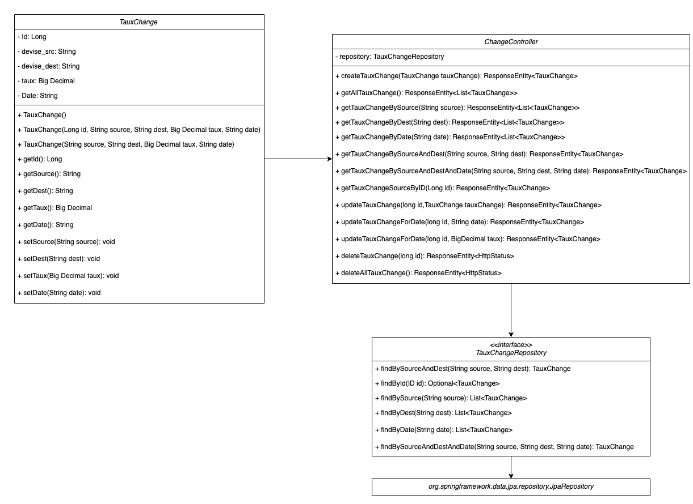

# Microservices - TauxChange

## Presentation
Gérer (créer , récupérer , modifier , supprimer) des taux de change entre deux devises. Un taux de change se caractérise 
par {"devise source" : "EUR", "devise destination" : "USD", "taux" : 1.22, "date" : "2021-05-25"} signifiant qu’en date 
du 25 mai 2021, 1 euro vaut 1.22 dollar US.

## Diagramme de classe



# Installation
## Set up the Spring Boot Application
```bash
git clone https://github.com/HenriAycard/Microservice-Tauxchange.git
```
```bash
./mvnw package && java -jar target/tauxchange
```
## Set up Docker
```bash
docker build -t springio/tauxchange .
docker run -p 8000:8000 -t springio/tauxchange
```
# Rest API
## Methods

| Methods | Urls                                    | Actions                                     |
| :----------:|:----------------------------------------| :-------------------------------------------|
| POST      | /taux-change                            | create new Taux Change                      |
| GET        | /taux-change                            | retrieve all Taux Change                    |
| GET        | /taux-change/id/{id}                    | retrieve Taux Change by {id}                |
| GET        | /taux-change/source/{source}            | retrieve Taux Change by {source}            |
| GET        | /taux-change/dest/{dest}                | retrieve Taux Change by {dest}              |
| GET        | /taux-change/date/{date}                | retrieve Taux Change by {date}              |
| GET        | /taux-change/source/{source}/dest/{dest}| retrieve Taux Change by {source} and {dest} |
| PUT        | /taux-change/id/{id}                    | update all Taux Change by {id}              |
| PUT        | /taux-change/id/{id}/date/{date}        | update {date} of Taux Change by {id}        |
| PUT        | /taux-change/id/{id}/taux/{taux}        | update {taux} of Taux Change by {id}        |
| DELETE  | /taux-change/id/{id}                    | delete Taux Change by {id}                  |

# Utilisation
## POST
### create new Taux Change
```bash
curl -X POST -H "Content-type: application/json" -d "{\"source\" : \"AUD\", \"dest\" : \"USD\", \"taux\" : 0.7586, \"date\" : \"2021-06-25\"}" "http://localhost:8000/taux-change"
```
```yaml
{
  "source":"AUD",
  "dest":"USD",
  "taux":0.7586,
  "date":"2021-06-25"
}
```
## GET
### retrieve all Taux Change
```bash
curl -X GET "http://localhost:8000/taux-change"
```
```yaml
[
    {
        "date": "2021-06-25",
        "dest": "JPY",
        "id": 10010,
        "source": "EUR",
        "taux": 132.18
    },
    {
        "date": "2021-06-25",
        "dest": "GBP",
        "id": 10015,
        "source": "USD",
        "taux": 0.72
    },
    {
        "date": "2020-06-25",
        "dest": "USD",
        "id": 10016,
        "source": "AUD",
        "taux": 0.76
    },
...]
```
### retrieve Taux Change by {id}
```bash
curl -X GET "http://localhost:8000/taux-change/id/10001"
```
```yaml
{
  "source":"EUR",
  "dest":"USD",
  "taux":1.19,
  "date":"2021-06-21"
}
```
### retrieve Taux Change by {source}
```bash
curl -X GET "http://localhost:8000/taux-change/source/USD"
```
```yaml
[
  {
    "date": "2021-06-21",
    "dest": "GBP",
    "id": 10011,
    "source": "USD",
    "taux": 0.72
  },
  {
    "date": "2021-06-22",
    "dest": "GBP",
    "id": 10012,
    "source": "USD",
    "taux": 0.72
  },
  {
    "date": "2021-06-23",
    "dest": "GBP",
    "id": 10013,
    "source": "USD",
    "taux": 0.72
  },
...]
```
### retrieve Taux Change by {dest}
```bash
curl -X GET "http://localhost:8000/taux-change/dest/USD"
```
```yaml
[
    {
        "date": "2021-06-21",
        "dest": "USD",
        "id": 10001,
        "source": "EUR",
        "taux": 1.19
    },
    {
        "date": "2021-06-22",
        "dest": "USD",
        "id": 10002,
        "source": "EUR",
        "taux": 1.19
    },
    {
        "date": "2021-06-23",
        "dest": "USD",
        "id": 10003,
        "source": "EUR",
        "taux": 1.19
    },
...]
```
### retrieve Taux Change by {date}
```bash
curl -X GET "http://localhost:8000/taux-change/date/2021-06-25"
```
```yaml
[
    {
        "date": "2021-06-25",
        "dest": "USD",
        "id": 10005,
        "source": "EUR",
        "taux": 1.19
    },
    {
        "date": "2021-06-25",
        "dest": "JPY",
        "id": 10010,
        "source": "EUR",
        "taux": 132.18
    },
    {
        "date": "2021-06-25",
        "dest": "GBP",
        "id": 10015,
        "source": "USD",
        "taux": 0.72
    }
]
```
### retrieve Taux Change by {source} and {dest}
```bash
curl -X GET "http://localhost:8000/taux-change/source/EUR/dest/USD"
```
```yaml
[
    {
        "date": "2021-06-21",
        "dest": "USD",
        "id": 10001,
        "source": "EUR",
        "taux": 1.19
    },
    {
        "date": "2021-06-22",
        "dest": "USD",
        "id": 10002,
        "source": "EUR",
        "taux": 1.19
    },
    {
        "date": "2021-06-23",
        "dest": "USD",
        "id": 10003,
        "source": "EUR",
        "taux": 1.19
    },
...]
```

## PUT
### update all Taux Change by {id}
```bash
curl -X PUT -H "Content-type: application/json" -d "{\"source\" : \"AUD\", \"dest\" : \"USD\", \"taux\" : 0.7582, \"date\" : \"2021-06-24\"}" "http://localhost:8000/taux-change/id/10016"
```
```yaml
{
    "date": "2021-06-24",
    "dest": "USD",
    "id": 10016,
    "source": "AUD",
    "taux": 0.7582
}
```
### update {date} of Taux Change by {id}
```bash
curl -X PUT "http://localhost:8000/taux-change/id/10016/date/2020-06-25"
```
```yaml
{
    "date": "2020-06-25",
    "dest": "USD",
    "id": 10016,
    "source": "AUD",
    "taux": 0.76
}
```
### update {taux} of Taux Change by {id}
```bash
curl -X PUT "http://localhost:8000/taux-change/id/10016/taux/0.7582"
```
```yaml
{
    "date": "2020-06-25",
    "dest": "USD",
    "id": 10016,
    "source": "AUD",
    "taux": 0.7582
}
```
## DELETE
### delete Taux Change by {id}
```bash
curl -X DELETE "http://localhost:8000/taux-change/id/10016"
```
